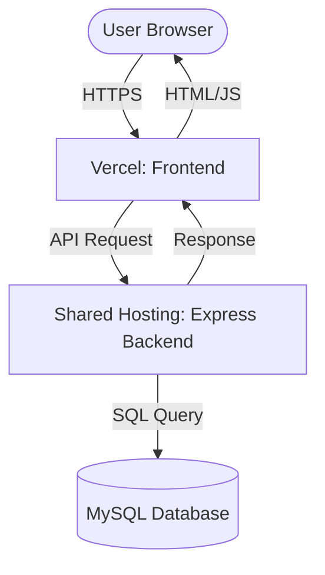

# DeshKhoj Handover Documentation

This document provides a comprehensive overview of the DeshKhoj platform, covering its architecture, codebase, security, deployment, and operational procedures.

---

## Table of Contents
1. [Technical Architecture](#-technical-architecture)
2. [Codebase Map](#-codebase-map)
3. [Deployment & Hosting](#-deployment--hosting)
4. [Security & Access Control](#-security--access-control)
5. [Known Issues & Roadmap](#-known-issues--roadmap)
6. [Video Tutorial Scripts](#-video-tutorial-scripts)

---

## 🏗️ Technical Architecture

This section outlines the high-level architecture of the DeshKhoj application.

### Tech Stack
- **Frontend**: Next.js 14+ (App Router), TypeScript, Tailwind CSS. Managed on **Vercel**.
- **Backend**: Node.js & Express.js, TypeScript. Managed on **Shared Business Hosting**.
- **Database**: Dual-compatibility layer for MySQL (Primary) and PostgreSQL.
- **Authentication**: JWT (JSON Web Tokens).

### Architecture Diagram


### Data flow
- **API calls**: Centralized in `frontend/src/lib/api.ts`.
- **CORS**: Restricted to authorized Vercel domains.
- **State Management**: React state hooks with dynamic data fetching on Page load.

---

## 🗺️ Codebase Map

### Repository Structure
```text
/
├── backend/            # Node.js/Express Server
├── frontend/           # Next.js Application
├── setup_mysql.sql     # Main database initialization script
└── .env                # Global environment variables
```

### Key Files (Backend)
- `src/db.ts`: **Critical utility**. Handles DB connection pooling and SQL abstraction.
- `src/routes/`: Contains all logic for `auth`, `admin`, `businesses`, and `products`.
- `src/middleware/auth.ts`: Implements the `adminOnly` and `protect` route guards.

### Key Files (Frontend)
- `src/app/`: Next.js App Router root. Contains pages for home, search, and admin.
- `src/lib/api.ts`: Centralized fetch wrapper for backend communication.
- `public/`: Static assets, logos, and global icons.

---

## 🚀 Deployment & Hosting

### Frontend (Vercel)
- **Workflow**: Automated CI/CD via GitHub integration.
- **Env**: Add `NEXT_PUBLIC_API_URL` to Vercel settings.

### Backend (Shared Hosting)
- **Workflow**: 
  1. Build locally: `npm run build`.
  2. Upload `dist/` and `package.json`.
  3. Run `npm install --omit=dev`.
  4. Use **PM2** to manage the process: `pm2 start dist/server.js`.

---

## 🛡️ Security & Access Control

1. **Authentication**: JWT tokens stored securely on the client. 24-hour expiration by default.
2. **Password Safety**: Hashed using **bcrypt** before database storage.
3. **RBAC**: Middleware enforces `admin` roles for all destructive or sensitive actions (approving businesses, deleting listings).
4. **Environment Safety**: All `.env` files are ignored by Git to prevent secret leakage.

---

## 🐛 Known Issues & Roadmap

### Known Bugs
- **Wildcard Search Error**: Newer versions of Express/path-to-regexp may require `(.*)` instead of `*` for wildcard routes.
- **Sequence Sync**: Use `backend/fix-sequences.js` if ID collisions occur after manual data imports.

### Technical Limitations
- **Image Storage**: Images are local to the shared host. They must be accessed via full absolute URLs from the frontend.

### Roadmap
- [ ] Implement advanced dashboard charts.
- [ ] Move images to S3/Cloudinary for better availability.
- [ ] Add PWA support for mobile installers.

---

## 🎬 Video Tutorial Scripts

### Script 1: User Flow (Frontend)
- **Scene**: Homepage -> Search -> Business Detail.
- **Narrative**: "Welcome to DeshKhoj. Users can easily find businesses through our categorized home screen or indexed search engine. Each business has a rich detail page with photos and contact info."

### Script 2: Admin Operations
- **Scene**: Dashboard -> Approval Flow.
- **Narrative**: "Administrators review registration requests in the dashboard. One-click approval makes listings live instantly on the platform."

### Script 3: Backend Infrastructure
- **Scene**: DB structure -> Environment setup.
- **Narrative**: "Our backend uses a unified `db.ts` file to manage queries safely across MySQL and PostgreSQL systems. Configurations are kept secure in environment files."

---
*End of Documentation*
